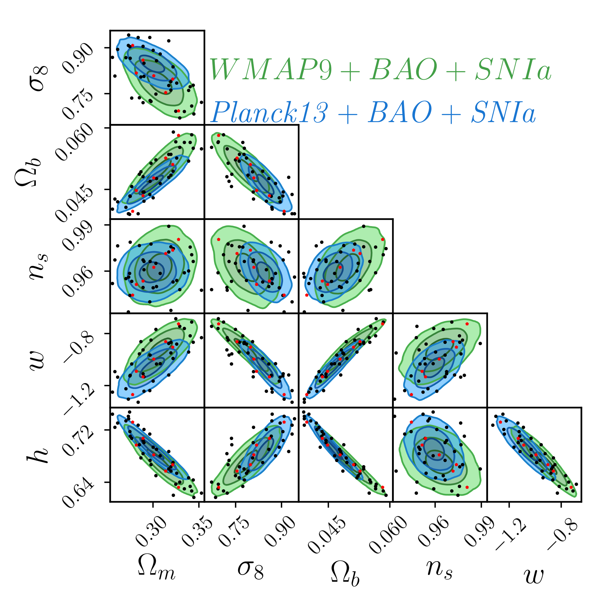

************************************************************
Cosmologies
************************************************************

The Aemulus simulations used to build the emulators were all run with different sets of cosmological parameters. As detailed in DeRose et al. (in prep.), these cosmologies were designed to span the space of `Planck13 <https://arxiv.org/abs/1303.5076>`_ + `WMAP9 <https://arxiv.org/abs/1212.5226>`_ + `BAO <http://adsabs.harvard.edu/abs/2014MNRAS.441...24A>`_ + `SNIa <http://adsabs.harvard.edu/cgi-bin/bib_query?arXiv:1105.3470>`_. The available parameters are :math:`\Omega_b, \Omega_m, w, n_s, H_0,\sigma_8, N_{\rm eff}`.

To access these cosmologies you can do

.. code::

   import aemulus_data as AD
   import numpy as np
   path = AD.path_to_building_box_cosmologies()
   cosmologies = np.genfromtxt(path)

The figure below shows the locations of all parameters except :math:`N_{eff}` which was not sampled by the Planck/WMAP chains.

